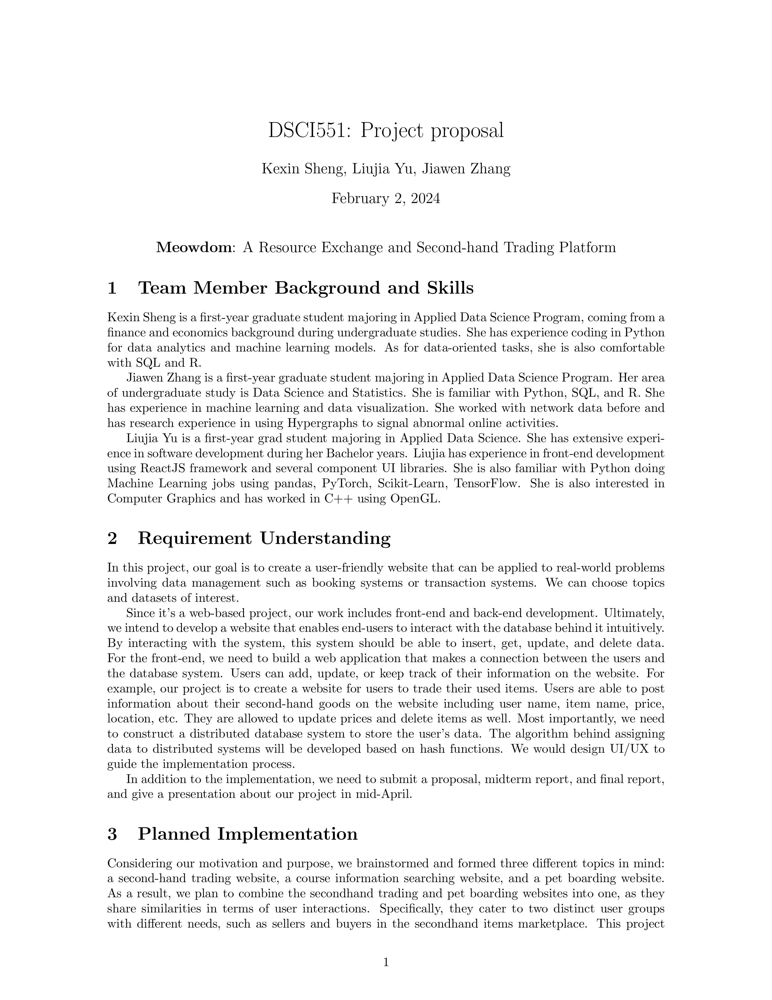
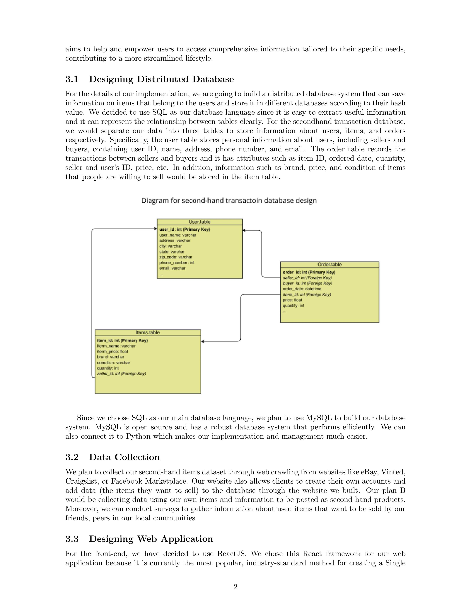
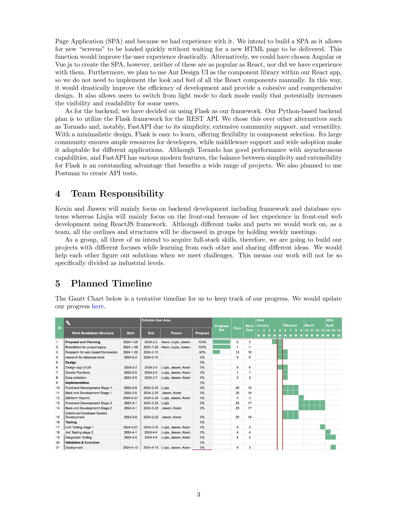

# MeowDom: A Resource Exchange Platform 


## Key Features

#### End-user app:

**JoinUs**: Register for a new account

**Post**: post the items you want to sell

**View**: view the list of items being posted on the website

After following steps in `How to Use` and successfully start the app, users can **register** for a new account, **post** the items, and **view** the list of items being posted on the website in home page.


## Installation and run

#### Back-end

In terminal of `/src` directory,  execute the following commands:

```sh
>>> pip install -r requirements.txt
>>> python run.py
```

#### Front-end

in the terminal of `/src/client/src`, execute the following commands:

```sh
>>> npm install 
>>> npm start
```


## Dependencies

### **Development Dependencies**

#### Back-end

```
blinker==1.8.0
click==8.1.7
Flask==3.0.3
Flask-Login==0.6.3
Flask-SQLAlchemy==3.1.1
Flask-WTF==1.2.1
greenlet==3.0.3
importlib_metadata==7.1.0
itsdangerous==2.2.0
Jinja2==3.1.3
MarkupSafe==2.1.5
SQLAlchemy==2.0.29
typing_extensions==4.11.0
Werkzeug==3.0.2
WTForms==3.1.2
zipp==3.18.1
```

They will be automatically installed when executing `pip install -r requirements.txt` in previous steps in **Usage / Installation and run / Back-end**

#### Front-end

```json
  "dependencies": {
    "@testing-library/jest-dom": "^5.17.0",
    "@testing-library/react": "^13.4.0",
    "@testing-library/user-event": "^13.5.0",
    "@babel/plugin-proposal-private-property-in-object": "^7.x.x",
    "antd": "^5.16.2",
    "bootstrap": "^5.3.3",
    "react": "^18.2.0",
    "react-bootstrap": "^2.10.2",
    "react-dom": "^18.2.0",
    "react-router-dom": "^6.22.3",
    "react-scripts": "5.0.1",
    "sass": "^1.75.0",
    "scss": "^0.2.4",
    "web-vitals": "^2.1.4"
  }
```

They will be automatically installed when executing `npm install`  in previous steps in **Usage / Installation and run / Front-end**.


## File Structure
```
Meowdom
│   README.md
│   Meowdom-Demo.pdf: slides for presentation 
│   Meowdom Design Work Flow.pdf: flow diagram for our project
│   DSCI551-FinalReport.pdf: final report
│
└───src
│   │   run.py: a file to run the backend code
│   │   requirements.txt: file used to automatically install python dependencies.
│   │   DB0.db: SQL database 1 
│   │   DB1.db: SQL: database 2 
│   │   dbmanager.py: an APP for manager to insert, update, and delete data 
│   │
│   └───client (frontend) 
│   │   │   
│   │   └───node_modules: directory auto generated by running 'npm install'
│   │   │   
│   │   └───public: stores static assets of front-end project.
│   │   │   │		favicon_io: the favicon icon that appears in the browser tab.
│   │   │   │		manifest.json: provides metadata about the application
│   │   │		
│   │   └───src: source files for the react project
│   │   │   │   
│   │   │   │		assets: pictures used in the website
│   │   │   │
│   │   │   └───pages: components of the SPA app
│   │   │   │		│		About: stores js and scss files for About page
│   │   │   │		│		Home: stores js and scss files for Home page
│   │   │   │		│		Layout: stores js and scss files for website layout, including headers and navigation bar
│   │   │   │		│		Login: stores js file for Login page(to be implemented)
│   │   │   │		│		NotFound: stores js file for NotFound page
│   │   │   │		│		PostNow: stores js and scss files for PostNow page
│   │   │   │		│		Register: stores js file for Register page
│   │   │   │		│		PostDetail: stores js file for PostDetail page(to be implemented)
│   │   │   │		
│   │   │   │		router: stores index.js for setting the react-router of whole project
│   │   │   │		index.js: renders the root element of index.html. Start of the react project.
│   │   │   │		main.scss: main style sheet for MeowDom.
│   │   │   
│   │   │   package.json: metadata of the react project. Stores name, dependencies, scripts etc. Essential for configuring the project.
│   │   
│   │   
│   └───flaskblog (backend) 
│       │   __init__.py: initialize the APP, create db engines, and define hash function
│       │   models.py: build three classes: user, item, and post 
│       │   forms.py: build two flaskforms(registration and post) to correct the data type from web and check validation 
│       │   routes.py: construct four web pages: home, about, JoinUs(register), and PostNow(post) 
│ 
│ 
└───instance (directory automatically generated by flask APP) 
│ 
│   
└───pics (pictures for proposal, final report and web design)
    │   meow1-3.jpg
    │   meow1-4.jpg
    │   meow1-6.jpg
    │   Proposal-0001.jpg
    │   Proposal-0002.jpg
    │   Proposal-0003.jpg
    
```


## Final Report

TBC.


## Proposal








## Authors

In alphabetical order: 

- Jiawen Zhang ([**@fionaz912**](https://github.com/fionaz912))
- Kexin Sheng (@[**Kexinds666**](https://github.com/Kexinds666))
- Liujia Yu ([**@LesleyYu** ](https://github.com/LesleyYu))